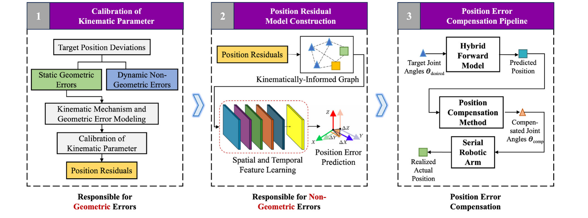
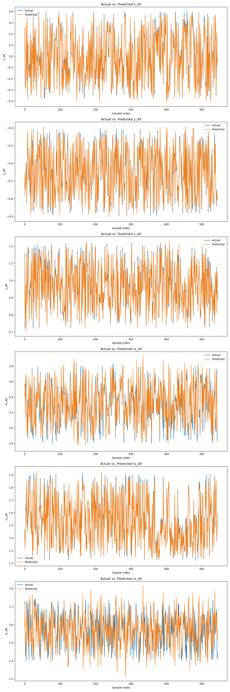
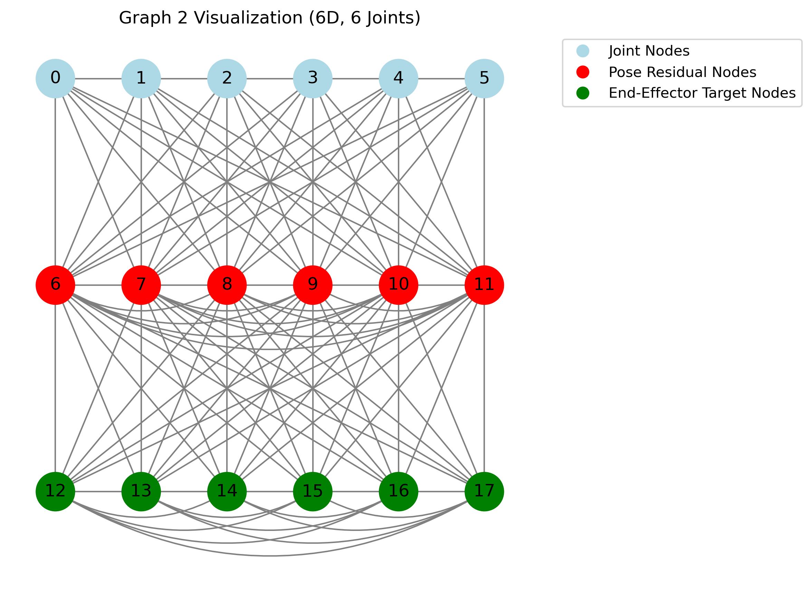

# Hybrid MDH + ASTGCN pose error compensation for serial industrial robots

Code from my master's thesis at Tsinghua University, *A Hybrid Error Compensation
Method for Enhancing the Pose Accuracy of Serial Industrial Robots*, supervised by
Prof. Shao Zhufeng and submitted in 2025 as part of a double degree with RWTH
Aachen University. Both anonymous reviewers graded the thesis A.

The repository is at the state it was in when I submitted. The work later became a
paper, "A graph-based hybrid position error compensation method for serial
industrial robots" (Yao, Jacobi, Shao and Kibireva, *Applied Soft Computing* 203,
2026), which goes beyond what is here. That later work is not in this repository.

Industrial robots are repeatable but not accurate. A UR5 comes back to a taught
point within 0.1 mm, but that point is about 2.6 mm from where the controller
thinks it is. Geometric calibration removes most of the gap. The rest comes from
joint clearance, thermal drift and control lag, which depend on the state of the
robot and cannot be captured by a kinematic model.

The method deals with that remainder in two stages:

1. **MDH calibration.** Fit a modified Denavit-Hartenberg model of the arm and
   compensate the geometric error.
2. **ASTGCN residual compensation.** Put the remaining error on a graph that
   follows the robot's kinematic chain, then train an attention-based
   spatio-temporal graph convolutional network to predict it.



<sub>Figure 2 from the paper. © 2026 Elsevier B.V., reproduced by an author.</sub>

## Results

Measured with a laser tracker on two robots with different drives and degrees of
freedom.

| Robot | DOF | Drive | Uncompensated | Hybrid compensation | Reduction |
|---|---|---|---|---|---|
| Universal Robots UR5 | 6 | Gear | 2.566 mm | **0.155 mm** | 94.0% |
| Barrett WAM | 7 | Cable | 17.766 mm | **2.918 mm** | 83.6% |

The UR5 figure is close to that robot's own repeatability of 0.1 mm, which is as
far as this kind of compensation can go. The baselines were uncalibrated, MDH
calibration alone, and ASTGCN compensation alone.



Per-axis metrics for that run are in `results/results_multi/`.
`results/all_models_metrics_compared.xlsx` puts every model side by side.

- Paper: [doi.org/10.1016/j.asoc.2026.116099](https://doi.org/10.1016/j.asoc.2026.116099)
- Datasets: [pauljac7700/serial_robots_datasets](https://github.com/pauljac7700/serial_robots_datasets),
  released openly so others can work on robot calibration with real measurements.
  [data/README.md](data/README.md) says what is public and what is not.

## Repository layout

| Path | Contents |
|---|---|
| `train_ASTGCN_*.py`, `test_ASTGCN_*.py` | Training and evaluation for the main model, single and multi target |
| `train_ASTGCN_multi_ablation.py` | Ablations: no attention, no spatial, no temporal |
| `train_TGCN.py`, `train_Conv_LSTM.py` | Learned baselines |
| `simple_baseline_models/` | MLP, historical average and VARX baselines |
| `prep_data_*.py`, `create_data_sequences/` | Preprocessing and sequence construction |
| `build_graphs/` | Graph topologies over the kinematic chain, and their visualisations |
| `model/` | Model definitions: the ASTGCN, its ablations, and the TGCN and ConvLSTM baselines |
| `lib/` | Importable helpers: graph Laplacians, masked metrics, config checks |
| `tools/` | Standalone scripts, run directly and imported by nothing: data cleaning, run comparison, figures |
| `config_*.yaml` | One config per model |
| `data/` | Graph topology, acquisition scripts, and where to get the datasets |
| `results/` | Evaluation output, per-model metrics and plots |
| `docs/` | Figures used in this README |

## Setup

Developed against Python 3.10.

```bash
git clone https://github.com/pauljac7700/ASTGCN-robot-pose-deviation.git
cd ASTGCN-robot-pose-deviation
python -m venv .venv && source .venv/bin/activate
pip install -r requirements.txt
```

The robot control packages needed to re-record data on a physical UR5 are
commented out in `requirements.txt`. Training and evaluation do not need them.

## Running

Every script takes `--config` and falls back to the matching YAML in the
repository root, so the commands below work on a fresh clone. Pass
`--config my_experiment.yaml` to run a variant without editing a tracked file. Any
script run with `--help` prints what it does.

Prepare the data, then train, then evaluate:

```bash
python prep_data_multi.py          # writes preprocessed splits and scalers into data/
python train_ASTGCN_multi.py       # defaults to config_ASTGCN.yaml
python test_ASTGCN_multi.py
```

For the single-target variant use `prep_data_single.py`, `train_ASTGCN_single.py`
and `test_ASTGCN_single.py`.

The ConvLSTM baseline consumes the ASTGCN splits, so it needs one extra
preprocessing pass run **after** `prep_data_multi.py`:

```bash
python prepare_data_Conv_LSTM.py
python train_Conv_LSTM.py          # defaults to config_Conv_LSTM.yaml
python test_Conv_LSTM.py
```

TGCN uses the ASTGCN splits directly:

```bash
python train_TGCN.py               # defaults to config_TGCN.yaml
python test_TGCN.py
```

The simpler baselines are single-shot scripts:

```bash
python simple_baseline_models/run_MLP_multi.py
python simple_baseline_models/run_HA_model.py
python simple_baseline_models/run_VARX_model.py
```

Training writes TensorBoard logs. Run `tensorboard --logdir runs` to see the loss
curves and the hyperparameter sweep.

## Configuration

The keys that change results most often:

| Key | Meaning |
|---|---|
| `dataset_dimension` | `3D` (UR5, position only) or `6D` (WAM, position and orientation) |
| `dataset_name`, `dataset_type` | Which CSV under `data/` to load, grid or random poses |
| `adjacency_matrix_file` | Selects the graph topology; the number in the filename picks the variant |
| `prep_data_incl_past_residuals` | Whether past residuals are fed back as input features |
| `model_name` | `ASTGCN_multi`, or an ablation variant |
| `nb_block`, `K`, `nb_chev_filter`, `nb_time_filter`, `len_input` | Model capacity and receptive field |

Grid poses are used for calibration and training, random poses for testing. The
reported errors are therefore on poses the model has never seen.

## Graph variants



The adjacency matrices in `build_graphs/` attach the residual to the kinematic
chain in different ways. The evaluation scripts read it back from different node
indices depending on which graph is in use:

- **Graphs 1, 3, 6, 7:** residual at node index `num_joints + 1`.
- **Graph 2:** residual spread across several nodes from index `num_joints`.
- **Graphs 4 and 5:** residual split into two nodes, position (3 features) and
  orientation (3 features). With a single prediction step the time dimension is
  squeezed and the two nodes flattened into one 6-feature vector.

Graphs 6 and 7 are controls, not candidates. Graph 6 keeps every node and edge but
shuffles the joint order along the chain. Graph 7 removes the joint-to-joint edges
altogether. If the model had scored as well on those as on graph 1, the graph would
be decoration. They are how I checked that the topology does real work.

## Citation

If you use this code or the datasets, please cite the paper:

```bibtex
@article{yao2026graph,
  title   = {A graph-based hybrid position error compensation method for serial industrial robots},
  author  = {Yao, Ming and Jacobi, Paul and Shao, Zhufeng and Kibireva, Anna},
  journal = {Applied Soft Computing},
  volume  = {203},
  pages   = {116099},
  year    = {2026},
  doi     = {10.1016/j.asoc.2026.116099}
}
```

Ming Yao and I contributed equally and are co-first authors. The paper is under
Elsevier copyright, so it is not included here. The DOI above is the canonical link.

The ASTGCN architecture comes from Guo et al., *Attention Based Spatial-Temporal
Graph Convolutional Networks for Traffic Flow Forecasting*, AAAI 2019.

## License

The code is MIT licensed, see [LICENSE](LICENSE). The datasets carry the terms
stated in the [dataset repository](https://github.com/pauljac7700/serial_robots_datasets).
The paper is © 2026 Elsevier B.V. and is not included here.

## Contact

Paul Jacobi, [paul.jacobi@rwth-aachen.de](mailto:paul.jacobi@rwth-aachen.de)
